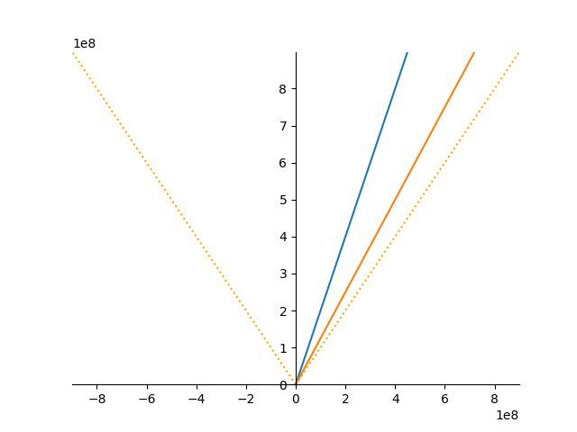

# Lorentz Transformation in Python

This program can plot inertial and non inertial world lines on a space time diagram and then animate then through lorentz transformations.

## Plotting Worldlines
To plot a worldline first configure a plot then use either the 'InertialWorldLine' or 'NonInertialWorldLine' class witha function defining its trajectory. 
each world line object can then be plotted using its object.plot() method. 
an example of this can be seen in the plot.py file.

## Animating Lorentz Transformations
To animate a Lorentz transformation first configure a plot, then use the .LorentzTransform() method on the worldlines to be transformed frame by frame. 
an example of this can be seen in the animate.py file.
### Spacetime Diagram Example

## Planned Features
- Create animations of worldlines
- plotting and transforming of non-inertial frames